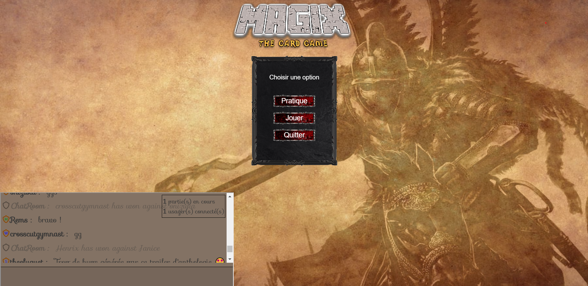
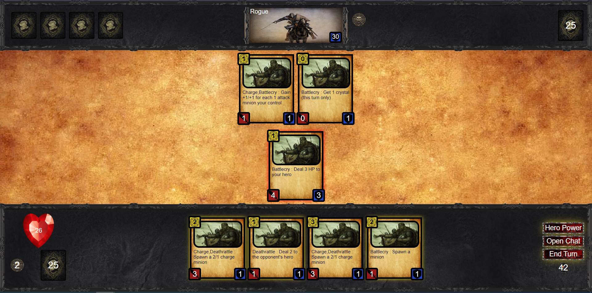

# API Card Game

## Table of Contents
<ul dir="auto">
  <li><a href="#screen-shots">Screen shots</a></li>
  <li><a href="#description">Description</a></li>
  <li><a href="#technologies-used">Technologies used</a></li>
  <li><a href="#author-info">Author Info</a></li>
</ul>

## Screen shots

## Description
The API card game is a website using php, JavaScript, html and css that connects to an API. To play, it requires a valid account. After authenticating, you can play the game with a player or a computer.

The website uses the MVC work pattern to separate the UI element and the security of the site. After sending and receiving data from the API, AJAX is used to change the game board during a match. 

## Technologies used
<ul>
  <li>HTML</li>
  <li>CSS</li>
  <li>PHP</li>
  <li>AJAX</li>
  <li>API</li>
</ul>

## Author-info
LinkedIn: www.linkedin.com/in/léandre-benoit
